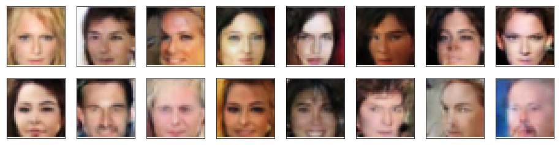

# DCGAN Face Generation Project

Deep Convolutional Generative Adversarial Network (DCGAN) designed and trained to generate realist human faces. This project was completed as part of Udacity's Deep Learning Nanodegree program.

# Project Overview
This project focuses on creating a DCGAN (including Discriminator & Generator models) in PyTorch that can learn to generate realistic human faces. The [CelebFaces Attributes Dataset (CelebA)](http://mmlab.ie.cuhk.edu.hk/projects/CelebA.html) is used for training.

## Notebook Sections
1. Downloading CelebA Dataset
2. Visualize Dataset
3. Create Dataloader & Normalize Images
4. Define the Model: Discriminator, Generator, and Combining the Models
5. Initializing Weights
6. Defining real and fake loss functions
7. Complete Training Function
8. Visualize Loss over Time
9. Generate Samples

# Results
The model generates reasonably realistic images of diverse faces with various features like: hairstyles, makeup, smiling/not smiling, facial hair, etc. All the images are blurry but this is characteristic of DCGAN output that is not focused on high-resolution outputs. There is still some distortion seen on some images: some ears are missing, eyebrows are not always present, and hair seems limited to just blondish-white and black.

# References
1. Original DCGAN Paper
> I. J. Goodfellow, et al. [Generative Adversarial Nets](http://papers.nips.cc/paper/5423-generative-adversarial-nets.pdf).  In Proceedings of NIPS, pages 2672–
2680, 2014.

2. [GAN Disadvantages and Tips to Help](https://github.com/tensorflow/magenta/blob/master/magenta/reviews/GAN.md#disadvantages)